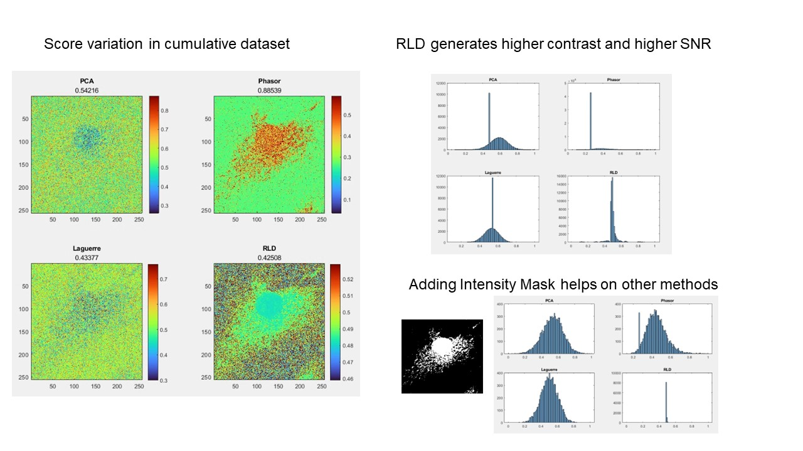
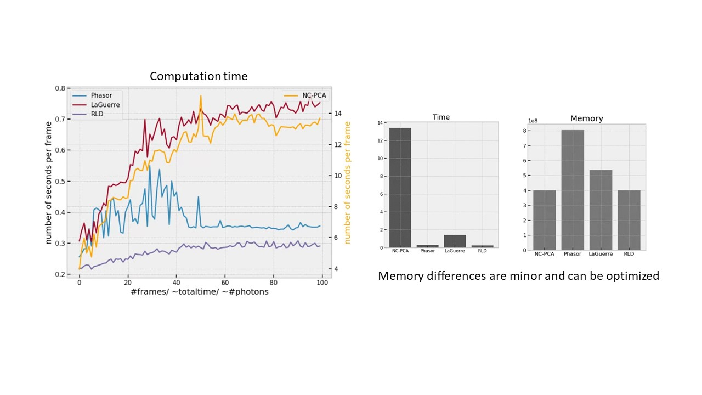

# RT-FLIM
This is the Real Time FLIM Estimation Algorithm Benchmarking Framework. 

To use the framework open the script in the Benchmarking folder. 
There are three sections that need checking on initial startup:
 - Python Environment used (Under Set Up The Workspace)
 - User Variables
 - Benchmarking Files
 
This framework collects timing data and estimates memory usage for the following FLIM estimation methods:
 - RLD
 - NC-PCA
 - Phasor
 - LaGuerre
 
More methods can be added without needing to change the overarching framework.

Comparison of fitting results from the four lifetime-esimation algorithms and the heterogenity in the lifetime distributions. The results are compared with groundtruth (accumulation of 100 frames) using vendor-supported FLIM software (SPCImage).

Computation Time comparison when fitting 100 FLIM datasets in a timelapse of 100 frames. The computation times and memory used is compared and plotted